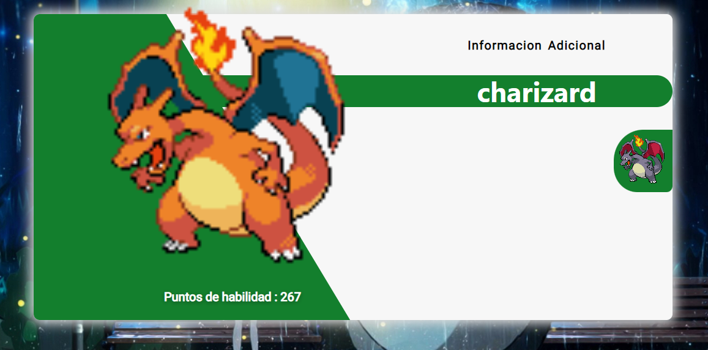

# Tarjetas de pokemon

Este proyecto esta utilizando la siguiente api del siguiente sitio: https://pokeapi.co

El proyecto se levante con:
### `npm init`

Para lanzar el proyecto se ejecuta:
### `npm start`

Ejecuta la aplicación en el modo de desarrollo. 
Abrir [http://localhost:3000](http://localhost:3000) en tu navegador

### imagen de la tarjeta 

